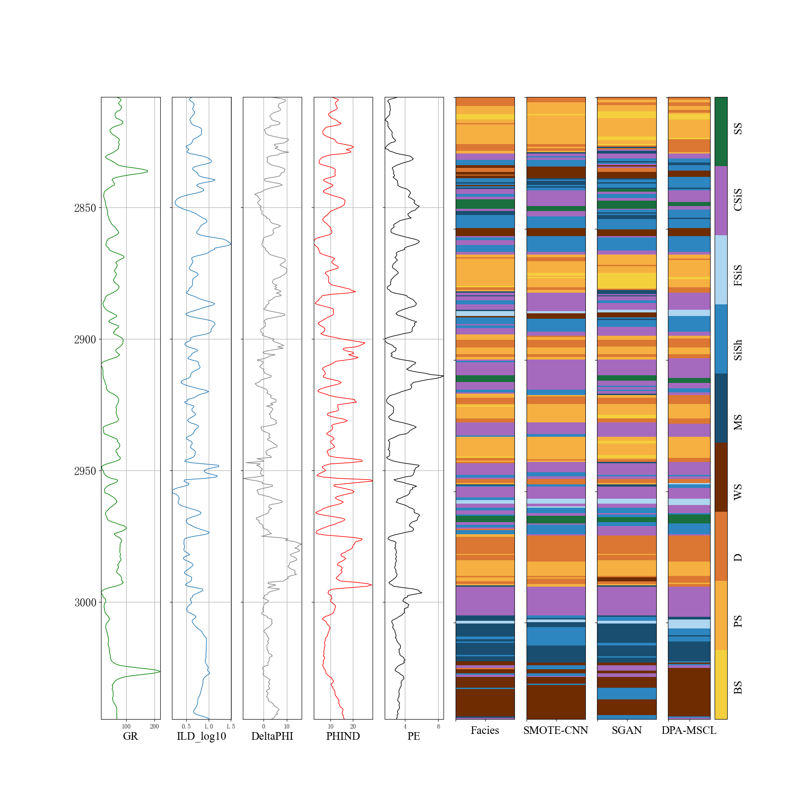
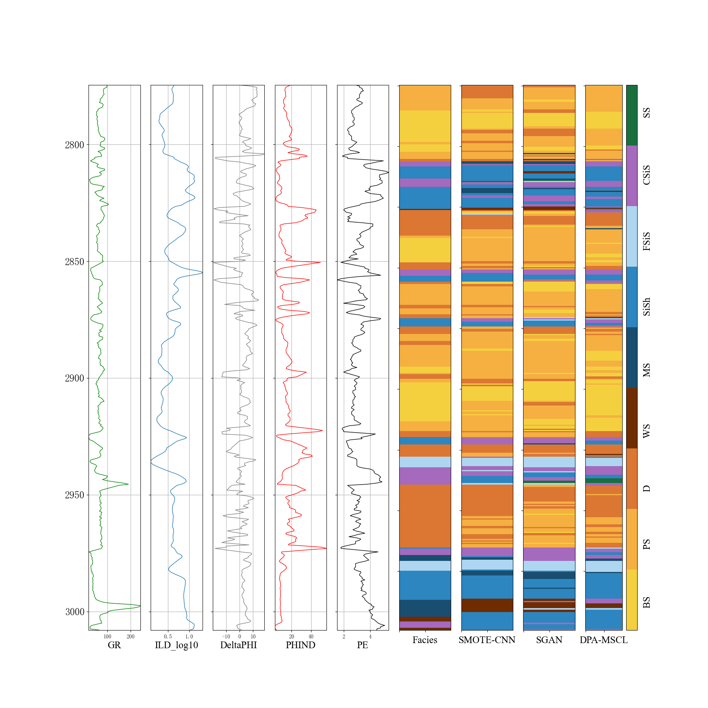

# **DPA-MSCL**
Because the Daqing Oilfield dataset is a private dataset, it was not uploaded, but the experimental code from the Daqing Oilfield dataset is still retained.
- **Comparison of Confusion Matrices for Different Model Predictions on the Daqing Dataset**
- - **Lithologic visualization**

  
  

